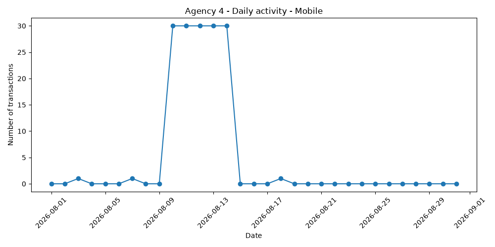

# Intelligent Data Analysis Agent for SQL Databases

An autonomous LLM-powered data analysis agent capable of answering natural-language questions about a SQL database.

The agent can inspect the database schema, generate and execute SQL queries, recover from SQL errors, perform statistical analyses with Python/Pandas, detect anomalies and trends, and generate visualizations.

## Features

- Natural-language interaction with SQL databases
- Automatic schema exploration
- Read-only SQL generation and execution
- Automatic SQL error correction
- Dynamic tool selection
- Anomaly detection
- Trend analysis
- Channel and transaction amount analysis
- Automatic Matplotlib visualizations
- Explicit abstention when requested information is unavailable
- Benchmark-based evaluation

## Architecture

The agent combines:

- **LLM:** Groq API with `openai/gpt-oss-20b`
- **Database:** SQLite
- **Data analysis:** Pandas / NumPy
- **Visualization:** Matplotlib
- **Tool calling:** custom Python functions for SQL and statistical analysis

Main tools include:

- `list_tables`
- `get_table_schema`
- `execute_sql`
- `detect_anomalies`
- `detect_anomalous_agencies`
- `detect_channel_anomalies`
- `detect_trend_anomalies`
- `detect_amount_anomalies`
- `plot_daily_activity`

## Benchmark

The agent was evaluated on a controlled benchmark of **50 questions** covering:

- SQL queries
- Database schema exploration
- Aggregations
- Temporal analysis
- Anomaly detection
- Trend detection
- Tool selection
- Visualization
- Abstention on unavailable information

### Results

| Metric | Result |
|---|---:|
| Questions passed | **50 / 50** |
| Tool use | **100%** |
| Tool selection | **100%** |
| Content checks | **100%** |
| Answer checks | **100%** |
| Abstention | **100%** |
| Visualization | **100%** |

These results refer specifically to the controlled benchmark included in this repository and should not be interpreted as general 100% accuracy on arbitrary questions.

## Project Structure

```text
intelligent-data-agent/
├── benchmarks/
│   ├── questions.json
│   └── results.json
├── data/
│   └── ground_truth.json
├── src/
│   ├── agent.py
│   ├── sql_tools.py
│   ├── analysis_tools.py
│   ├── visualization_tools.py
│   ├── create_database.py
│   ├── generate_data.py
│   └── run_benchmark.py
├── .gitignore
├── requirements.txt
└── README.md

# Intelligent Data Analysis Agent for SQL Databases

An autonomous LLM-powered data analysis agent capable of answering natural-language questions about a SQL database.

The agent can inspect the database schema, generate and execute SQL queries, recover from SQL errors, perform statistical analyses with Python/Pandas, detect anomalies and trends, and generate visualizations.

## Features

- Natural-language interaction with SQL databases
- Automatic schema exploration
- Read-only SQL generation and execution
- Automatic SQL error correction
- Dynamic tool selection
- Anomaly detection
- Trend analysis
- Channel and transaction amount analysis
- Automatic Matplotlib visualizations
- Explicit abstention when requested information is unavailable
- Benchmark-based evaluation

## Architecture

The agent combines:

- **LLM:** Groq API with `openai/gpt-oss-20b`
- **Database:** SQLite
- **Data analysis:** Pandas / NumPy
- **Visualization:** Matplotlib
- **Tool calling:** custom Python functions for SQL and statistical analysis

Main tools include:

- `list_tables`
- `get_table_schema`
- `execute_sql`
- `detect_anomalies`
- `detect_anomalous_agencies`
- `detect_channel_anomalies`
- `detect_trend_anomalies`
- `detect_amount_anomalies`
- `plot_daily_activity`

## Benchmark

The agent was evaluated on a controlled benchmark of **50 questions** covering:

- SQL queries
- Database schema exploration
- Aggregations
- Temporal analysis
- Anomaly detection
- Trend detection
- Tool selection
- Visualization
- Abstention on unavailable information

### Results

| Metric | Result |
|---|---:|
| Questions passed | **50 / 50** |
| Tool use | **100%** |
| Tool selection | **100%** |
| Content checks | **100%** |
| Answer checks | **100%** |
| Abstention | **100%** |
| Visualization | **100%** |

These results refer specifically to the controlled benchmark included in this repository and should not be interpreted as general 100% accuracy on arbitrary questions.

## Project Structure

```text
intelligent-data-agent/
├── benchmarks/
│   ├── questions.json
│   └── results.json
├── data/
│   └── ground_truth.json
├── src/
│   ├── agent.py
│   ├── sql_tools.py
│   ├── analysis_tools.py
│   ├── visualization_tools.py
│   ├── create_database.py
│   ├── generate_data.py
│   └── run_benchmark.py
├── .gitignore
├── requirements.txt
└── README.md
```

## Installation

Clone the repository:

```bash
git clone https://github.com/bachir6c/intelligent-data-agent.git
cd intelligent-data-agent
```

Create a virtual environment:

```bash
python -m venv .venv
```

Activate it on Windows:

```powershell
.venv\Scripts\Activate.ps1
```

On Linux/macOS:

```bash
source .venv/bin/activate
```

Install the dependencies:

```bash
pip install -r requirements.txt
```

Create a `.env` file at the root of the project:

```env
GROQ_API_KEY=your_groq_api_key
```

## Run the Agent

Run:

```bash
python src/agent.py
```

Then ask a question in natural language.

Example:

```text
Quel type d'opération présente une forte hausse progressive
à l'agence 21 en mai 2026 ?
```

Example answer:

```text
Cash Deposit
```

The agent automatically selects the appropriate tools, queries the database and performs the required analysis.

## Streamlit Interface

The project includes a Streamlit web interface for interacting with the agent through a chat-like application.

Run the interface with:

```bash
python -m streamlit run streamlit_app.py
```

The interface allows users to:

- ask natural-language questions about the SQL database;
- receive answers generated by the agent;
- trigger SQL, statistical analysis and anomaly-detection tools;
- generate and display visualizations directly in the application.

Example:

```text
Plot the daily number of mobile bank transfers
for agency 4 in August 2026.
```

The agent automatically identifies the relevant operation type, agency, channel and metric, then generates the corresponding visualization.

## Example of Tool Calling

For the previous question, the agent can automatically call:

```text
detect_trend_anomalies(
    agency_id=21,
    start_date="2026-05-01",
    end_date="2026-05-31"
)
```

and identify:

```text
Cash Deposit
Weekly counts: [1, 11, 25, 38, 60]
```

## Visualization

The agent can also generate plots from natural-language requests.

Example:

```text
Plot the daily number of mobile bank transfers
for agency 4 in August 2026.
```

The agent automatically identifies:

- Agency: `4`
- Operation type: `Bank Transfer`
- Channel: `Mobile`
- Metric: transaction count

and generates the corresponding visualization:



## Run the Benchmark

Run:

```bash
python src/run_benchmark.py
```

The benchmark evaluates the agent on 50 controlled questions.

Results are stored in:

```text
benchmarks/results.json
```

Current benchmark result:

```text
Questions:       50
Passed:          50
Failed:           0
Accuracy:       100%

Tool use:       100%
Tool selection: 100%
Content:        100%
Answer:         100%
Abstention:     100%
Chart:          100%
```

## Safety and Reliability

The agent is designed to avoid inventing information about the database.

It:

- inspects the database schema before using unknown tables or columns;
- executes only read-only SQL queries;
- uses database results as the source of truth;
- can recover from SQL generation errors;
- explicitly abstains when requested information is unavailable;
- does not assume unavailable metadata such as currencies or external information.

## Security

API credentials are loaded through environment variables.

The `.env` file is excluded from Git through `.gitignore` and must never be committed to the repository.

## Technologies

- Python
- SQL
- SQLite
- Pandas
- NumPy
- Matplotlib
- Groq API
- LLM tool calling
- Git / GitHub

## Author

**Mouhamed Bachir CISSE**

Engineering student in Applied Mathematics and Modeling  
Polytech Lyon